# 100 Free Admin Dashboards

Free, complete admin dashboard templates in HTML, CSS and JavaScript. Each dashboard has 30 or more pages: an overview with charts, lists, detail pages, forms, a calendar or board, reports, settings, team, login and sign up pages.

**[See all live demos](https://mmrahmanbappi.github.io/100-free-admin-dashboards/)**

25 of 100 are ready. New dashboards are added in batches of ten.

## Why use these dashboards

- **Complete.** Every dashboard is a full set of pages, not a single screen.
- **Light and dark themes.** A button at the top switches them, and the choice is remembered.
- **No build step.** Open `index.html` in a browser. There is nothing to install.
- **Works on phones.** The sidebar turns into a menu on small screens.
- **Easy to rebrand.** Change one color in the CSS and the whole dashboard follows.
- **Free for business use.** MIT license.

## How to use one

1. Open the [live demos](https://mmrahmanbappi.github.io/100-free-admin-dashboards/) and pick a dashboard.
2. Download the repository, or copy just the folder you want.
3. Open `index.html` in your browser, then replace the demo data with your own.

## Dashboards

| Preview | Dashboard |
|---|---|
| [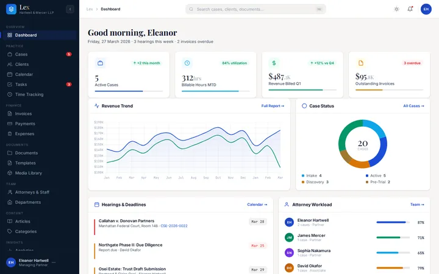](https://mmrahmanbappi.github.io/100-free-admin-dashboards/lex/) | **1. Lex** Law Firm  Cases, clients, billing and documents for a law firm, with light and dark themes.  32 pages / [Live demo](https://mmrahmanbappi.github.io/100-free-admin-dashboards/lex/) / [Code](lex/) |
| [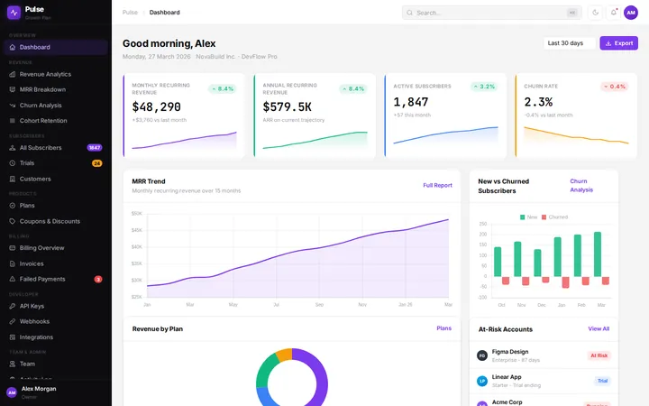](https://mmrahmanbappi.github.io/100-free-admin-dashboards/pulse/) | **2. Pulse** SaaS Subscriptions  Subscribers, plans, revenue and churn for a subscription business.  34 pages / [Live demo](https://mmrahmanbappi.github.io/100-free-admin-dashboards/pulse/) / [Code](pulse/) |
| [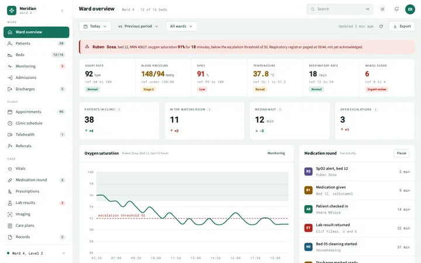](https://mmrahmanbappi.github.io/100-free-admin-dashboards/scrub/) | **3. Scrub** Hospital  Patients, beds, medications and staff rota for a hospital ward.  36 pages / [Live demo](https://mmrahmanbappi.github.io/100-free-admin-dashboards/scrub/) / [Code](scrub/) |
| [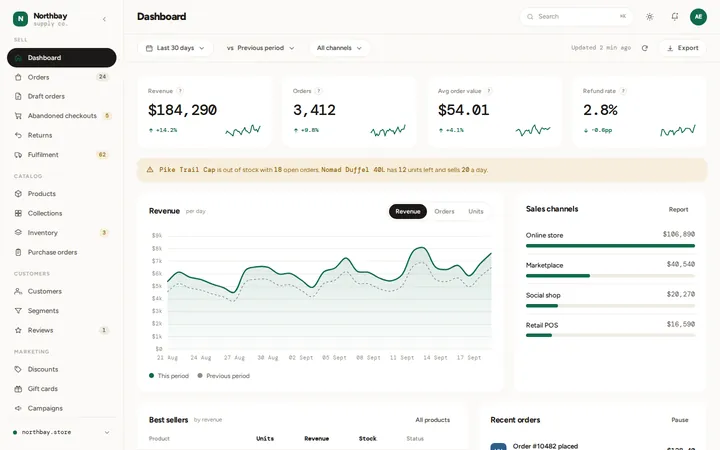](https://mmrahmanbappi.github.io/100-free-admin-dashboards/shelf/) | **4. Shelf** E-commerce  Orders, products, inventory and customers for an online store.  36 pages / [Live demo](https://mmrahmanbappi.github.io/100-free-admin-dashboards/shelf/) / [Code](shelf/) |
| [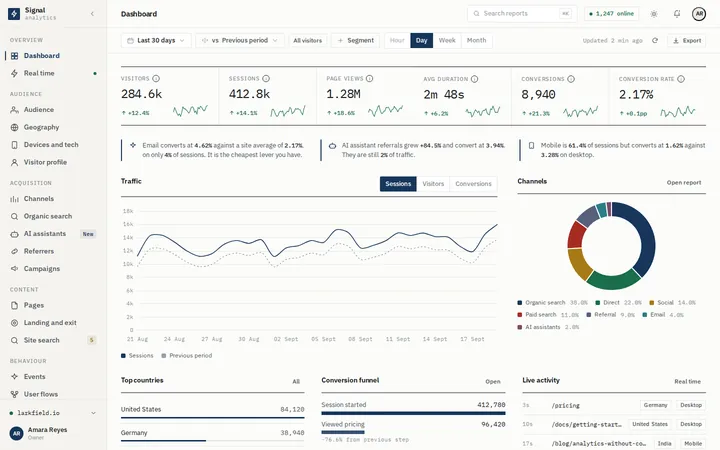](https://mmrahmanbappi.github.io/100-free-admin-dashboards/signal/) | **5. Signal** Web Analytics  Traffic, conversions, SEO health and AI referrals for a website.  37 pages / [Live demo](https://mmrahmanbappi.github.io/100-free-admin-dashboards/signal/) / [Code](signal/) |
| [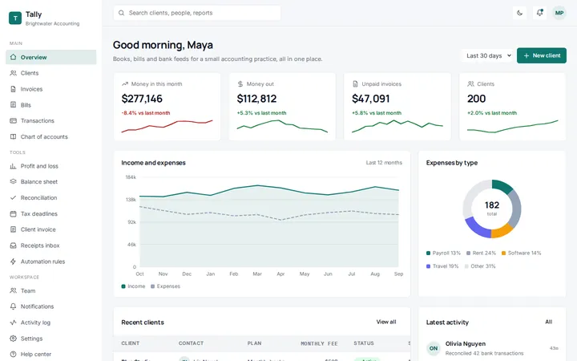](https://mmrahmanbappi.github.io/100-free-admin-dashboards/tally/) | **6. Tally** Accounting  Books, bills and bank feeds for a small accounting practice, all in one place.  34 pages / [Live demo](https://mmrahmanbappi.github.io/100-free-admin-dashboards/tally/) / [Code](tally/) |
| [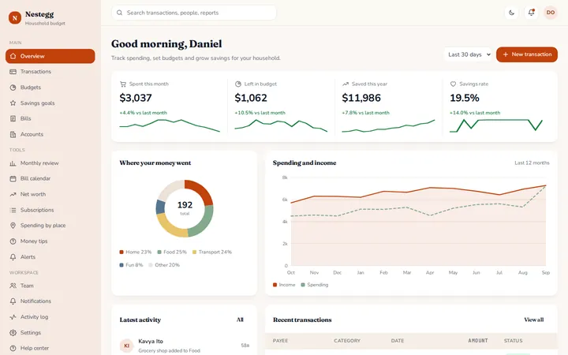](https://mmrahmanbappi.github.io/100-free-admin-dashboards/nestegg/) | **7. Nestegg** Personal Finance  Track spending, set budgets and grow savings for your household.  34 pages / [Live demo](https://mmrahmanbappi.github.io/100-free-admin-dashboards/nestegg/) / [Code](nestegg/) |
| [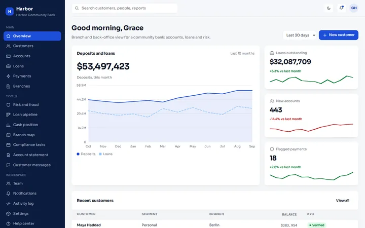](https://mmrahmanbappi.github.io/100-free-admin-dashboards/harbor/) | **8. Harbor** Banking  Branch and back-office view for a community bank: accounts, loans and risk.  34 pages / [Live demo](https://mmrahmanbappi.github.io/100-free-admin-dashboards/harbor/) / [Code](harbor/) |
| [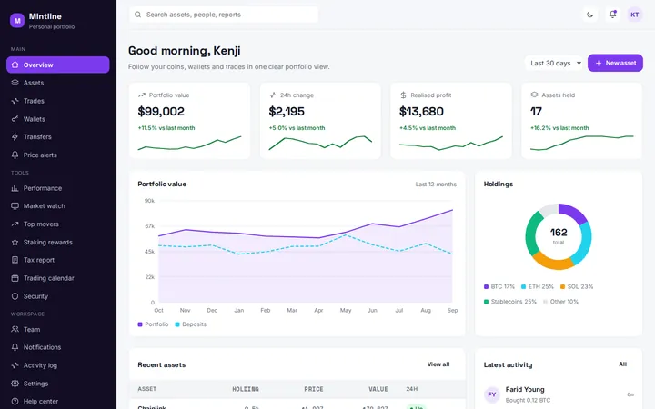](https://mmrahmanbappi.github.io/100-free-admin-dashboards/mintline/) | **9. Mintline** Crypto Portfolio  Follow your coins, wallets and trades in one clear portfolio view.  34 pages / [Live demo](https://mmrahmanbappi.github.io/100-free-admin-dashboards/mintline/) / [Code](mintline/) |
| [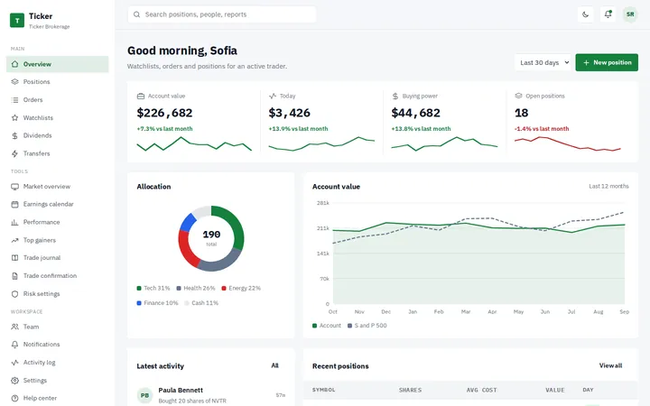](https://mmrahmanbappi.github.io/100-free-admin-dashboards/ticker/) | **10. Ticker** Stock Trading  Watchlists, orders and positions for an active trader.  34 pages / [Live demo](https://mmrahmanbappi.github.io/100-free-admin-dashboards/ticker/) / [Code](ticker/) |
| [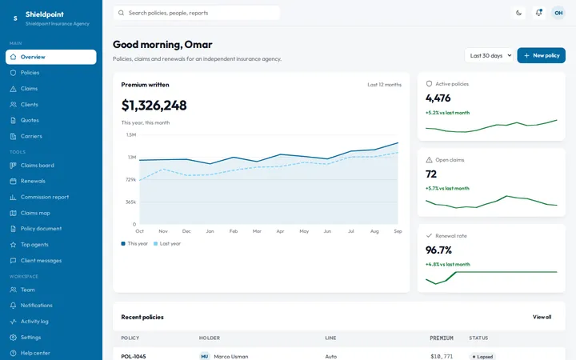](https://mmrahmanbappi.github.io/100-free-admin-dashboards/shieldpoint/) | **11. Shieldpoint** Insurance  Policies, claims and renewals for an independent insurance agency.  34 pages / [Live demo](https://mmrahmanbappi.github.io/100-free-admin-dashboards/shieldpoint/) / [Code](shieldpoint/) |
| [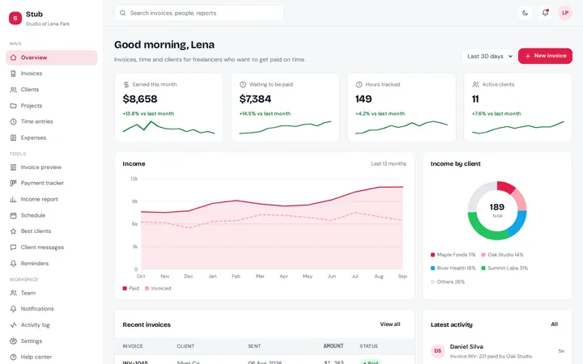](https://mmrahmanbappi.github.io/100-free-admin-dashboards/stub/) | **12. Stub** Freelancer Invoicing  Invoices, time and clients for freelancers who want to get paid on time.  34 pages / [Live demo](https://mmrahmanbappi.github.io/100-free-admin-dashboards/stub/) / [Code](stub/) |
| [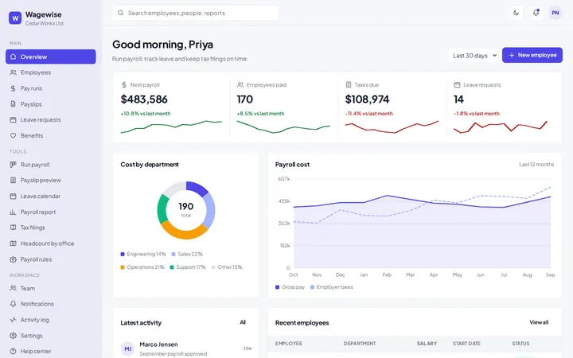](https://mmrahmanbappi.github.io/100-free-admin-dashboards/wagewise/) | **13. Wagewise** Payroll  Run payroll, track leave and keep tax filings on time.  34 pages / [Live demo](https://mmrahmanbappi.github.io/100-free-admin-dashboards/wagewise/) / [Code](wagewise/) |
| [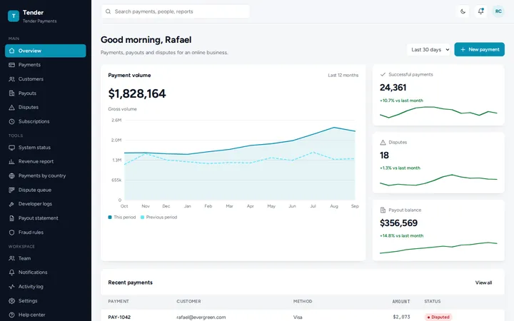](https://mmrahmanbappi.github.io/100-free-admin-dashboards/tender/) | **14. Tender** Payment Gateway  Payments, payouts and disputes for an online business.  34 pages / [Live demo](https://mmrahmanbappi.github.io/100-free-admin-dashboards/tender/) / [Code](tender/) |
| [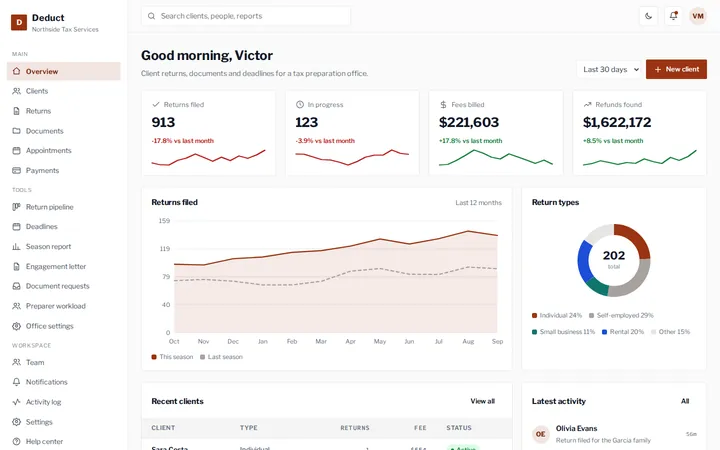](https://mmrahmanbappi.github.io/100-free-admin-dashboards/deduct/) | **15. Deduct** Tax Preparation  Client returns, documents and deadlines for a tax preparation office.  34 pages / [Live demo](https://mmrahmanbappi.github.io/100-free-admin-dashboards/deduct/) / [Code](deduct/) |
| [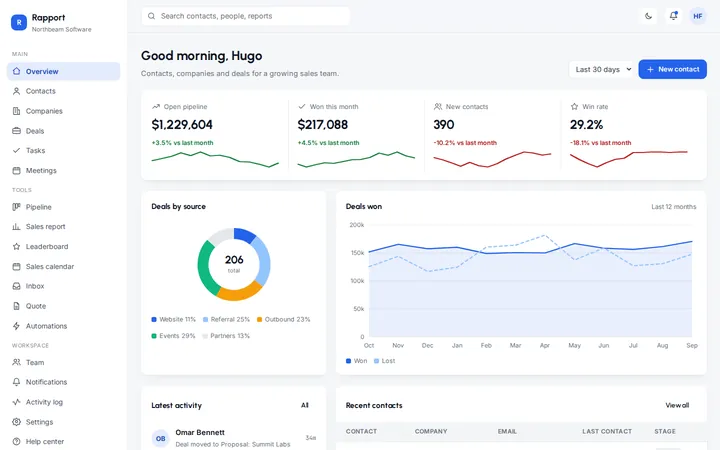](https://mmrahmanbappi.github.io/100-free-admin-dashboards/rapport/) | **16. Rapport** CRM  Contacts, companies and deals for a growing sales team.  34 pages / [Live demo](https://mmrahmanbappi.github.io/100-free-admin-dashboards/rapport/) / [Code](rapport/) |
| [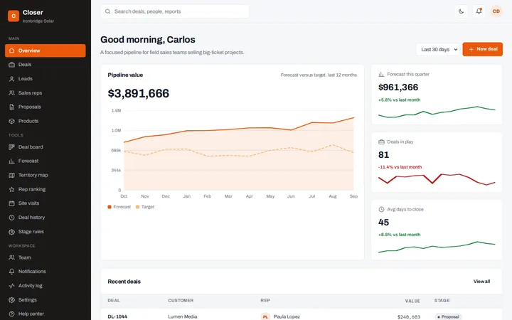](https://mmrahmanbappi.github.io/100-free-admin-dashboards/closer/) | **17. Closer** Sales Pipeline  A focused pipeline for field sales teams selling big-ticket projects.  34 pages / [Live demo](https://mmrahmanbappi.github.io/100-free-admin-dashboards/closer/) / [Code](closer/) |
| [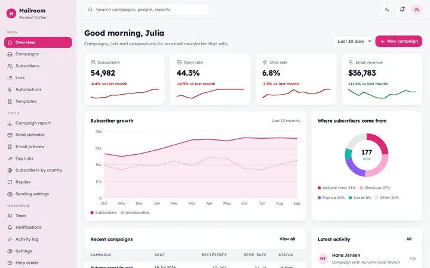](https://mmrahmanbappi.github.io/100-free-admin-dashboards/mailroom/) | **18. Mailroom** Email Marketing  Campaigns, lists and automations for an email newsletter that sells.  34 pages / [Live demo](https://mmrahmanbappi.github.io/100-free-admin-dashboards/mailroom/) / [Code](mailroom/) |
| [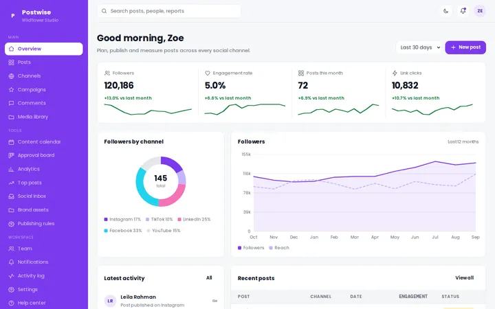](https://mmrahmanbappi.github.io/100-free-admin-dashboards/postwise/) | **19. Postwise** Social Media Management  Plan, publish and measure posts across every social channel.  34 pages / [Live demo](https://mmrahmanbappi.github.io/100-free-admin-dashboards/postwise/) / [Code](postwise/) |
| [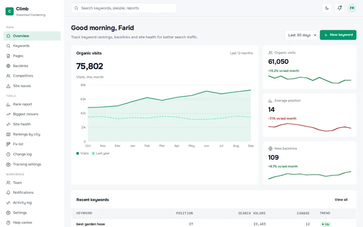](https://mmrahmanbappi.github.io/100-free-admin-dashboards/climb/) | **20. Climb** SEO Rank Tracker  Track keyword rankings, backlinks and site health for better search traffic.  34 pages / [Live demo](https://mmrahmanbappi.github.io/100-free-admin-dashboards/climb/) / [Code](climb/) |
| [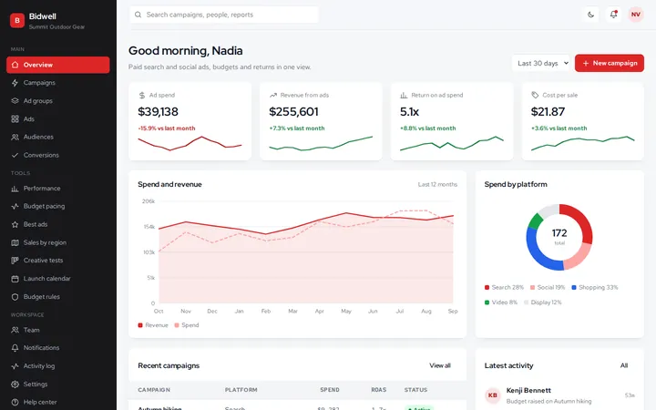](https://mmrahmanbappi.github.io/100-free-admin-dashboards/bidwell/) | **21. Bidwell** Ad Campaigns  Paid search and social ads, budgets and returns in one view.  34 pages / [Live demo](https://mmrahmanbappi.github.io/100-free-admin-dashboards/bidwell/) / [Code](bidwell/) |
| [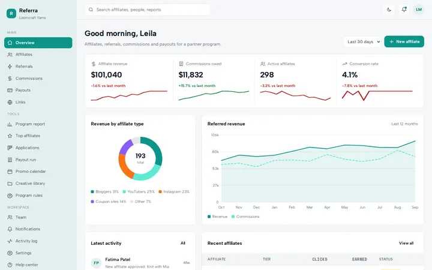](https://mmrahmanbappi.github.io/100-free-admin-dashboards/referra/) | **22. Referra** Affiliate Program  Affiliates, referrals, commissions and payouts for a partner program.  34 pages / [Live demo](https://mmrahmanbappi.github.io/100-free-admin-dashboards/referra/) / [Code](referra/) |
| [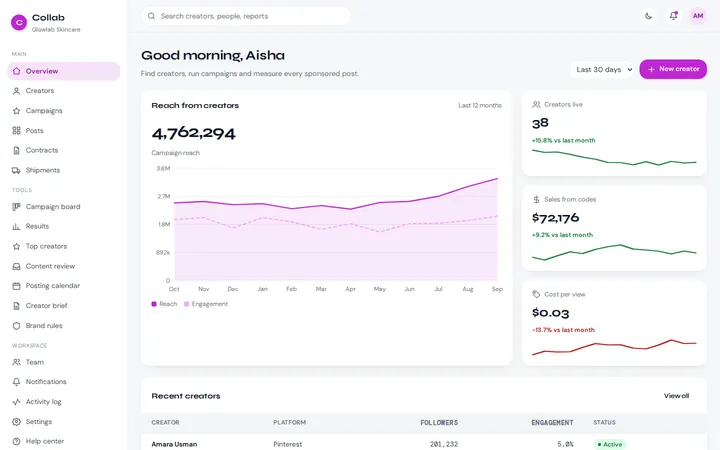](https://mmrahmanbappi.github.io/100-free-admin-dashboards/collab/) | **23. Collab** Influencer Marketing  Find creators, run campaigns and measure every sponsored post.  34 pages / [Live demo](https://mmrahmanbappi.github.io/100-free-admin-dashboards/collab/) / [Code](collab/) |
| [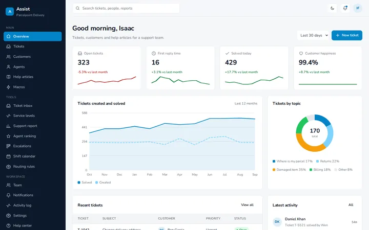](https://mmrahmanbappi.github.io/100-free-admin-dashboards/assist/) | **24. Assist** Customer Support Helpdesk  Tickets, customers and help articles for a support team.  34 pages / [Live demo](https://mmrahmanbappi.github.io/100-free-admin-dashboards/assist/) / [Code](assist/) |
| [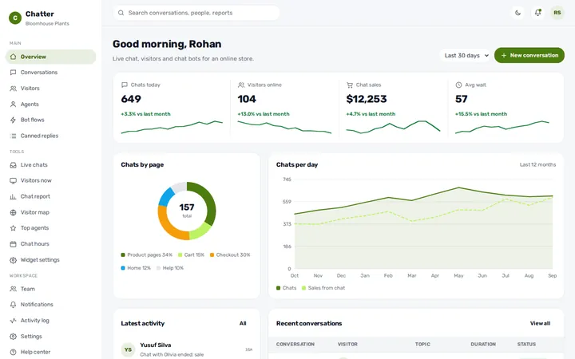](https://mmrahmanbappi.github.io/100-free-admin-dashboards/chatter/) | **25. Chatter** Live Chat  Live chat, visitors and chat bots for an online store.  34 pages / [Live demo](https://mmrahmanbappi.github.io/100-free-admin-dashboards/chatter/) / [Code](chatter/) |

## Coming next

CRM, Sales pipeline, Email marketing, Social media management, SEO rank tracker, Ad campaigns, Affiliate program, Influencer marketing, Customer support helpdesk, Live chat, Surveys and NPS, Events and ticketing, HR and employees, Recruitment, Project management, Kanban tasks, Time tracking, Inventory and warehouse, Logistics and fleet, Supply chain, Manufacturing, Construction, Facility management, Field service, Server monitoring, Cloud cost, API analytics, Cyber security, IT helpdesk, CI/CD pipelines, Database admin, AI chatbot analytics, AI usage and cost, Mobile app analytics, Web hosting panel, Domains and DNS, School management, Online courses, University admissions, Student portal, Tutor marketplace, Library, Exams and quizzes, Dental clinic, Pharmacy, Gym and fitness, Personal health, Veterinary clinic, Therapy practice, Diagnostic lab, Nutrition coach, Hotel, Restaurant POS, Food delivery, Travel agency, Airline operations, Car rental, Salon booking, Coworking space, Blog CMS, Podcast analytics, Video creator studio, Music artist, Photography studio, Newsletter, Digital agency, Nonprofit donations, Church and community, City services, Election results, Air quality, Solar and energy, Smart home, Farm and agriculture, Sports team.

## License

[MIT](LICENSE). Some dashboards include third-party fonts and libraries with their own open licenses, listed in their folders.

Made by [MM Rahman Bappi](https://mmseo.app/).
