# 100 Free Admin Dashboards

Free, complete admin dashboard templates in HTML, CSS and JavaScript. Each dashboard has 30 or more pages: an overview with charts, lists, detail pages, forms, a calendar or board, reports, settings, team, login and sign up pages.

**[See all live demos](https://mmrahmanbappi.github.io/100-free-admin-dashboards/)**

95 of 100 are ready. New dashboards are added in batches of ten.

## Why use these dashboards

- **Complete.** Every dashboard is a full set of pages, not a single screen.
- **Light and dark themes.** A button at the top switches them, and the choice is remembered.
- **No build step.** Open `index.html` in a browser. There is nothing to install.
- **Works on phones.** The sidebar turns into a menu on small screens.
- **Easy to rebrand.** Change one color in the CSS and the whole dashboard follows.
- **Free for business use.** MIT license.

## How to use one

1. Open the [live demos](https://mmrahmanbappi.github.io/100-free-admin-dashboards/) and pick a dashboard.
2. Download the repository, or copy just the folder you want.
3. Open `index.html` in your browser, then replace the demo data with your own.

## Dashboards

| Preview | Dashboard |
|---|---|
|  | **1. Lex** Law Firm  Cases, clients, billing and documents for a law firm, with light and dark themes.  32 pages / [Live demo](https://mmrahmanbappi.github.io/100-free-admin-dashboards/lex/) / [Code](lex/) |
|  | **2. Pulse** SaaS Subscriptions  Subscribers, plans, revenue and churn for a subscription business.  34 pages / [Live demo](https://mmrahmanbappi.github.io/100-free-admin-dashboards/pulse/) / [Code](pulse/) |
|  | **3. Scrub** Hospital  Patients, beds, medications and staff rota for a hospital ward.  36 pages / [Live demo](https://mmrahmanbappi.github.io/100-free-admin-dashboards/scrub/) / [Code](scrub/) |
|  | **4. Shelf** E-commerce  Orders, products, inventory and customers for an online store.  36 pages / [Live demo](https://mmrahmanbappi.github.io/100-free-admin-dashboards/shelf/) / [Code](shelf/) |
|  | **5. Signal** Web Analytics  Traffic, conversions, SEO health and AI referrals for a website.  37 pages / [Live demo](https://mmrahmanbappi.github.io/100-free-admin-dashboards/signal/) / [Code](signal/) |
|  | **6. Tally** Accounting  Books, bills and bank feeds for a small accounting practice, all in one place.  34 pages / [Live demo](https://mmrahmanbappi.github.io/100-free-admin-dashboards/tally/) / [Code](tally/) |
|  | **7. Nestegg** Personal Finance  Track spending, set budgets and grow savings for your household.  34 pages / [Live demo](https://mmrahmanbappi.github.io/100-free-admin-dashboards/nestegg/) / [Code](nestegg/) |
|  | **8. Harbor** Banking  Branch and back-office view for a community bank: accounts, loans and risk.  34 pages / [Live demo](https://mmrahmanbappi.github.io/100-free-admin-dashboards/harbor/) / [Code](harbor/) |
|  | **9. Mintline** Crypto Portfolio  Follow your coins, wallets and trades in one clear portfolio view.  34 pages / [Live demo](https://mmrahmanbappi.github.io/100-free-admin-dashboards/mintline/) / [Code](mintline/) |
|  | **10. Ticker** Stock Trading  Watchlists, orders and positions for an active trader.  34 pages / [Live demo](https://mmrahmanbappi.github.io/100-free-admin-dashboards/ticker/) / [Code](ticker/) |
|  | **11. Shieldpoint** Insurance  Policies, claims and renewals for an independent insurance agency.  34 pages / [Live demo](https://mmrahmanbappi.github.io/100-free-admin-dashboards/shieldpoint/) / [Code](shieldpoint/) |
|  | **12. Stub** Freelancer Invoicing  Invoices, time and clients for freelancers who want to get paid on time.  34 pages / [Live demo](https://mmrahmanbappi.github.io/100-free-admin-dashboards/stub/) / [Code](stub/) |
|  | **13. Wagewise** Payroll  Run payroll, track leave and keep tax filings on time.  34 pages / [Live demo](https://mmrahmanbappi.github.io/100-free-admin-dashboards/wagewise/) / [Code](wagewise/) |
|  | **14. Tender** Payment Gateway  Payments, payouts and disputes for an online business.  34 pages / [Live demo](https://mmrahmanbappi.github.io/100-free-admin-dashboards/tender/) / [Code](tender/) |
|  | **15. Deduct** Tax Preparation  Client returns, documents and deadlines for a tax preparation office.  34 pages / [Live demo](https://mmrahmanbappi.github.io/100-free-admin-dashboards/deduct/) / [Code](deduct/) |
|  | **16. Rapport** CRM  Contacts, companies and deals for a growing sales team.  34 pages / [Live demo](https://mmrahmanbappi.github.io/100-free-admin-dashboards/rapport/) / [Code](rapport/) |
|  | **17. Closer** Sales Pipeline  A focused pipeline for field sales teams selling big-ticket projects.  34 pages / [Live demo](https://mmrahmanbappi.github.io/100-free-admin-dashboards/closer/) / [Code](closer/) |
|  | **18. Mailroom** Email Marketing  Campaigns, lists and automations for an email newsletter that sells.  34 pages / [Live demo](https://mmrahmanbappi.github.io/100-free-admin-dashboards/mailroom/) / [Code](mailroom/) |
|  | **19. Postwise** Social Media Management  Plan, publish and measure posts across every social channel.  34 pages / [Live demo](https://mmrahmanbappi.github.io/100-free-admin-dashboards/postwise/) / [Code](postwise/) |
|  | **20. Climb** SEO Rank Tracker  Track keyword rankings, backlinks and site health for better search traffic.  34 pages / [Live demo](https://mmrahmanbappi.github.io/100-free-admin-dashboards/climb/) / [Code](climb/) |
|  | **21. Bidwell** Ad Campaigns  Paid search and social ads, budgets and returns in one view.  34 pages / [Live demo](https://mmrahmanbappi.github.io/100-free-admin-dashboards/bidwell/) / [Code](bidwell/) |
|  | **22. Referra** Affiliate Program  Affiliates, referrals, commissions and payouts for a partner program.  34 pages / [Live demo](https://mmrahmanbappi.github.io/100-free-admin-dashboards/referra/) / [Code](referra/) |
|  | **23. Collab** Influencer Marketing  Find creators, run campaigns and measure every sponsored post.  34 pages / [Live demo](https://mmrahmanbappi.github.io/100-free-admin-dashboards/collab/) / [Code](collab/) |
|  | **24. Assist** Customer Support Helpdesk  Tickets, customers and help articles for a support team.  34 pages / [Live demo](https://mmrahmanbappi.github.io/100-free-admin-dashboards/assist/) / [Code](assist/) |
|  | **25. Chatter** Live Chat  Live chat, visitors and chat bots for an online store.  34 pages / [Live demo](https://mmrahmanbappi.github.io/100-free-admin-dashboards/chatter/) / [Code](chatter/) |
| [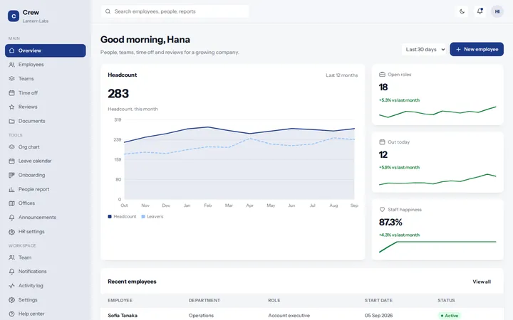](https://mmrahmanbappi.github.io/100-free-admin-dashboards/crew/) | **26. Crew** HR and Employees  People, teams, time off and reviews for a growing company.  34 pages / [Live demo](https://mmrahmanbappi.github.io/100-free-admin-dashboards/crew/) / [Code](crew/) |
| [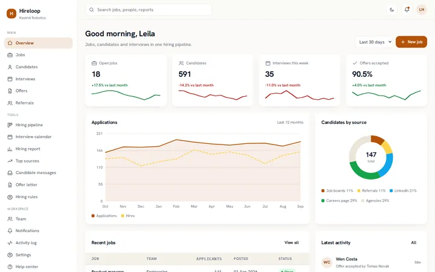](https://mmrahmanbappi.github.io/100-free-admin-dashboards/hireloop/) | **27. Hireloop** Recruitment  Jobs, candidates and interviews in one hiring pipeline.  34 pages / [Live demo](https://mmrahmanbappi.github.io/100-free-admin-dashboards/hireloop/) / [Code](hireloop/) |
| [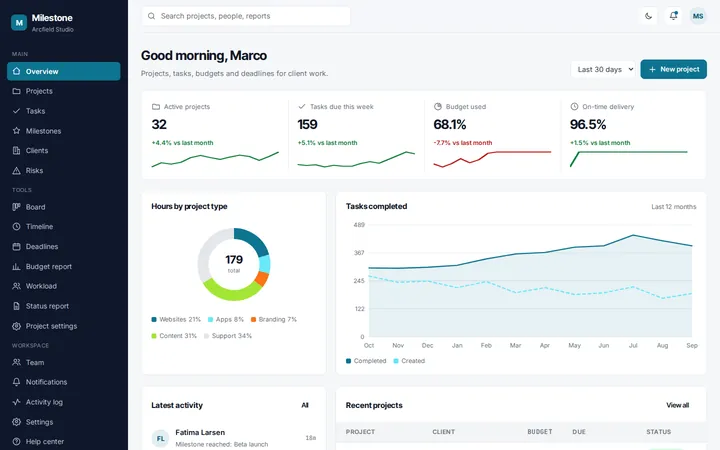](https://mmrahmanbappi.github.io/100-free-admin-dashboards/milestone/) | **28. Milestone** Project Management  Projects, tasks, budgets and deadlines for client work.  34 pages / [Live demo](https://mmrahmanbappi.github.io/100-free-admin-dashboards/milestone/) / [Code](milestone/) |
| [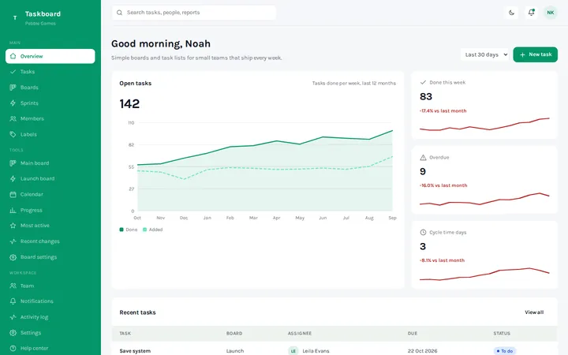](https://mmrahmanbappi.github.io/100-free-admin-dashboards/taskboard/) | **29. Taskboard** Kanban Tasks  Simple boards and task lists for small teams that ship every week.  34 pages / [Live demo](https://mmrahmanbappi.github.io/100-free-admin-dashboards/taskboard/) / [Code](taskboard/) |
| [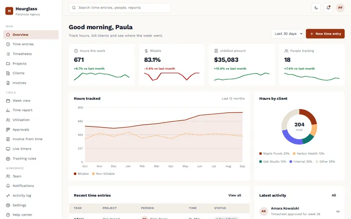](https://mmrahmanbappi.github.io/100-free-admin-dashboards/hourglass/) | **30. Hourglass** Time Tracking  Track hours, bill clients and see where the week went.  34 pages / [Live demo](https://mmrahmanbappi.github.io/100-free-admin-dashboards/hourglass/) / [Code](hourglass/) |
| [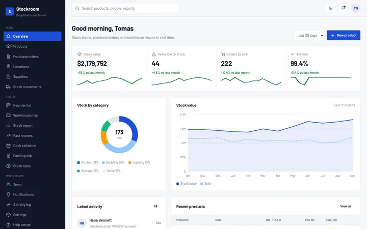](https://mmrahmanbappi.github.io/100-free-admin-dashboards/stockroom/) | **31. Stockroom** Inventory and Warehouse  Stock levels, purchase orders and warehouse moves in real time.  34 pages / [Live demo](https://mmrahmanbappi.github.io/100-free-admin-dashboards/stockroom/) / [Code](stockroom/) |
| [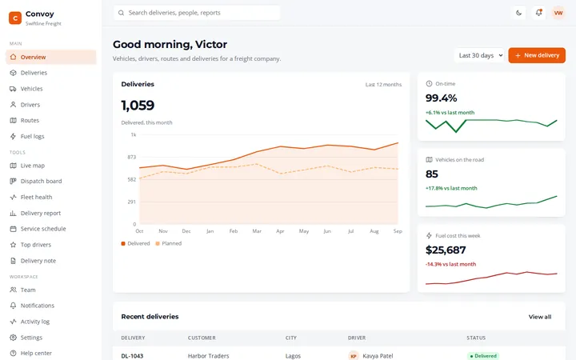](https://mmrahmanbappi.github.io/100-free-admin-dashboards/convoy/) | **32. Convoy** Logistics and Fleet  Vehicles, drivers, routes and deliveries for a freight company.  34 pages / [Live demo](https://mmrahmanbappi.github.io/100-free-admin-dashboards/convoy/) / [Code](convoy/) |
| [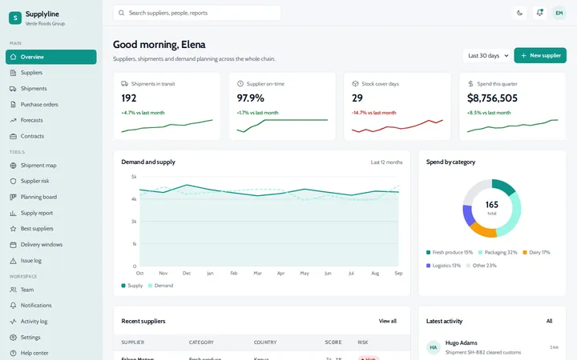](https://mmrahmanbappi.github.io/100-free-admin-dashboards/supplyline/) | **33. Supplyline** Supply Chain  Suppliers, shipments and demand planning across the whole chain.  34 pages / [Live demo](https://mmrahmanbappi.github.io/100-free-admin-dashboards/supplyline/) / [Code](supplyline/) |
| [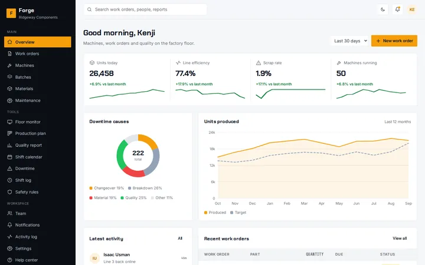](https://mmrahmanbappi.github.io/100-free-admin-dashboards/forge/) | **34. Forge** Manufacturing  Machines, work orders and quality on the factory floor.  34 pages / [Live demo](https://mmrahmanbappi.github.io/100-free-admin-dashboards/forge/) / [Code](forge/) |
| [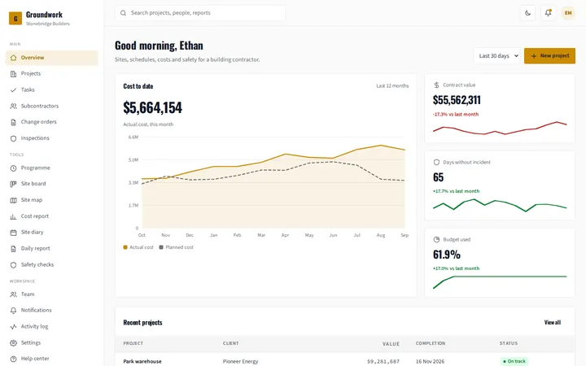](https://mmrahmanbappi.github.io/100-free-admin-dashboards/groundwork/) | **35. Groundwork** Construction  Sites, schedules, costs and safety for a building contractor.  34 pages / [Live demo](https://mmrahmanbappi.github.io/100-free-admin-dashboards/groundwork/) / [Code](groundwork/) |
| [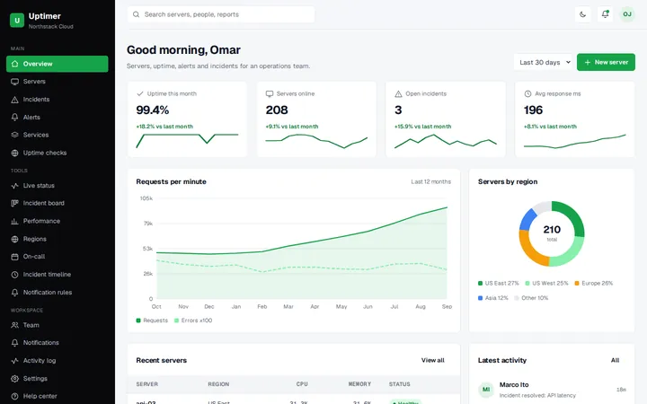](https://mmrahmanbappi.github.io/100-free-admin-dashboards/uptimer/) | **36. Uptimer** Server Monitoring  Servers, uptime, alerts and incidents for an operations team.  34 pages / [Live demo](https://mmrahmanbappi.github.io/100-free-admin-dashboards/uptimer/) / [Code](uptimer/) |
| [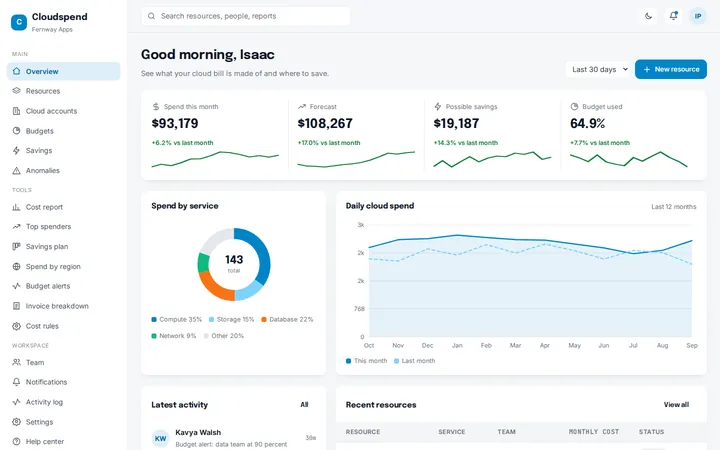](https://mmrahmanbappi.github.io/100-free-admin-dashboards/cloudspend/) | **37. Cloudspend** Cloud Cost  See what your cloud bill is made of and where to save.  34 pages / [Live demo](https://mmrahmanbappi.github.io/100-free-admin-dashboards/cloudspend/) / [Code](cloudspend/) |
| [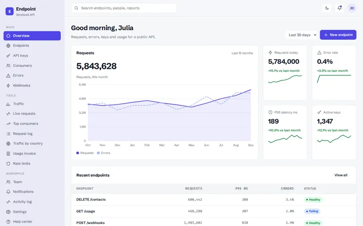](https://mmrahmanbappi.github.io/100-free-admin-dashboards/endpoint/) | **38. Endpoint** API Analytics  Requests, errors, keys and usage for a public API.  34 pages / [Live demo](https://mmrahmanbappi.github.io/100-free-admin-dashboards/endpoint/) / [Code](endpoint/) |
| [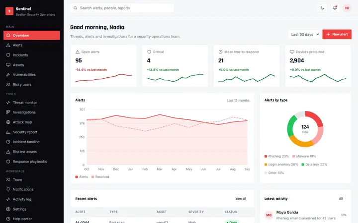](https://mmrahmanbappi.github.io/100-free-admin-dashboards/sentinel/) | **39. Sentinel** Cyber Security  Threats, alerts and investigations for a security operations team.  34 pages / [Live demo](https://mmrahmanbappi.github.io/100-free-admin-dashboards/sentinel/) / [Code](sentinel/) |
| [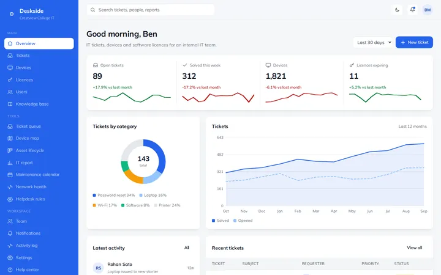](https://mmrahmanbappi.github.io/100-free-admin-dashboards/deskside/) | **40. Deskside** IT Helpdesk  IT tickets, devices and software licences for an internal IT team.  34 pages / [Live demo](https://mmrahmanbappi.github.io/100-free-admin-dashboards/deskside/) / [Code](deskside/) |
| [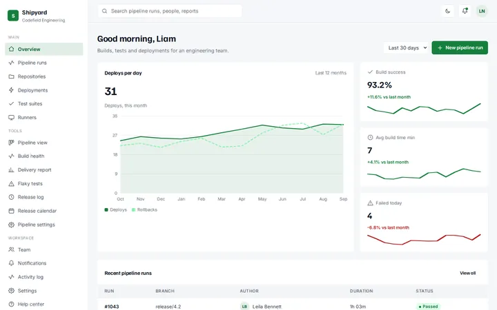](https://mmrahmanbappi.github.io/100-free-admin-dashboards/shipyard/) | **41. Shipyard** CI/CD Pipelines  Builds, tests and deployments for an engineering team.  34 pages / [Live demo](https://mmrahmanbappi.github.io/100-free-admin-dashboards/shipyard/) / [Code](shipyard/) |
| [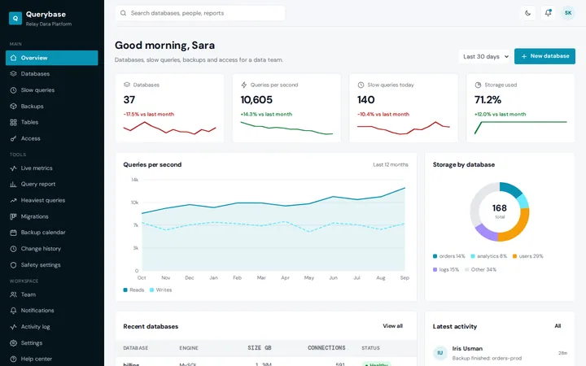](https://mmrahmanbappi.github.io/100-free-admin-dashboards/querybase/) | **42. Querybase** Database Admin  Databases, slow queries, backups and access for a data team.  34 pages / [Live demo](https://mmrahmanbappi.github.io/100-free-admin-dashboards/querybase/) / [Code](querybase/) |
| [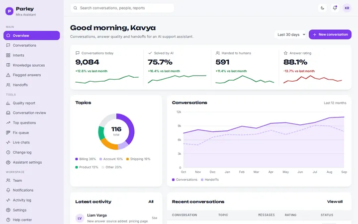](https://mmrahmanbappi.github.io/100-free-admin-dashboards/parley/) | **43. Parley** AI Chatbot Analytics  Conversations, answer quality and handoffs for an AI support assistant.  34 pages / [Live demo](https://mmrahmanbappi.github.io/100-free-admin-dashboards/parley/) / [Code](parley/) |
| [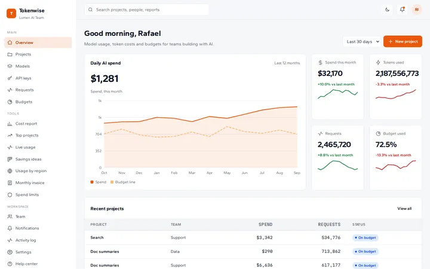](https://mmrahmanbappi.github.io/100-free-admin-dashboards/tokenwise/) | **44. Tokenwise** AI Usage and Cost  Model usage, token costs and budgets for teams building with AI.  34 pages / [Live demo](https://mmrahmanbappi.github.io/100-free-admin-dashboards/tokenwise/) / [Code](tokenwise/) |
| [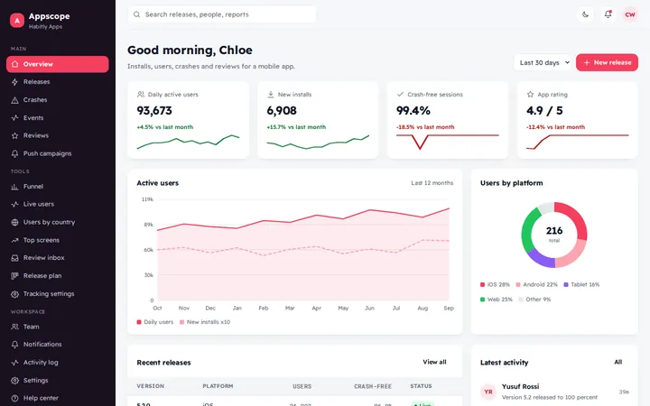](https://mmrahmanbappi.github.io/100-free-admin-dashboards/appscope/) | **45. Appscope** Mobile App Analytics  Installs, users, crashes and reviews for a mobile app.  34 pages / [Live demo](https://mmrahmanbappi.github.io/100-free-admin-dashboards/appscope/) / [Code](appscope/) |
| [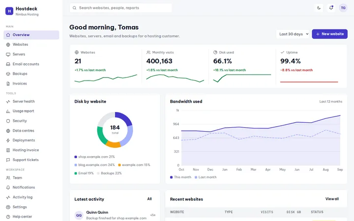](https://mmrahmanbappi.github.io/100-free-admin-dashboards/hostdeck/) | **46. Hostdeck** Web Hosting Panel  Websites, servers, email and backups for a hosting customer.  34 pages / [Live demo](https://mmrahmanbappi.github.io/100-free-admin-dashboards/hostdeck/) / [Code](hostdeck/) |
| [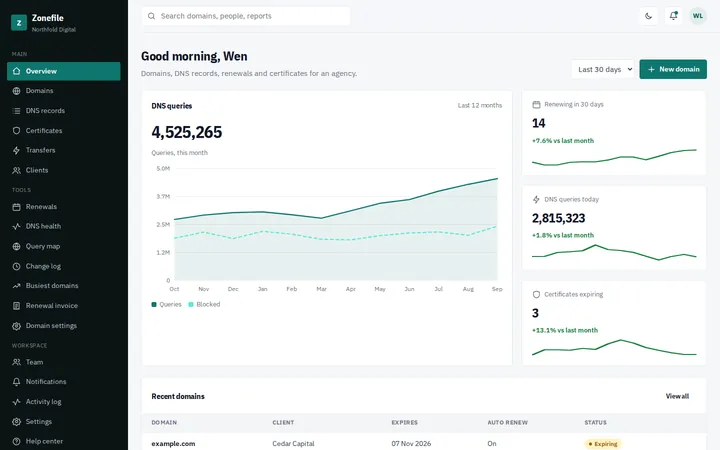](https://mmrahmanbappi.github.io/100-free-admin-dashboards/zonefile/) | **47. Zonefile** Domains and DNS  Domains, DNS records, renewals and certificates for an agency.  34 pages / [Live demo](https://mmrahmanbappi.github.io/100-free-admin-dashboards/zonefile/) / [Code](zonefile/) |
| [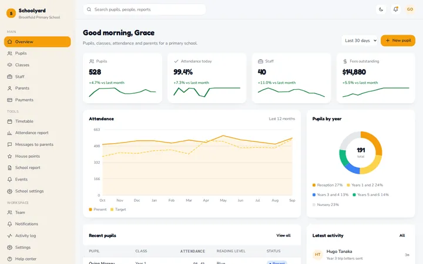](https://mmrahmanbappi.github.io/100-free-admin-dashboards/schoolyard/) | **48. Schoolyard** School Management  Pupils, classes, attendance and parents for a primary school.  34 pages / [Live demo](https://mmrahmanbappi.github.io/100-free-admin-dashboards/schoolyard/) / [Code](schoolyard/) |
| [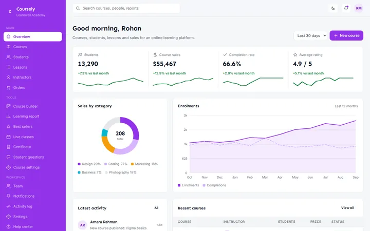](https://mmrahmanbappi.github.io/100-free-admin-dashboards/coursely/) | **49. Coursely** Online Courses  Courses, students, lessons and sales for an online learning platform.  34 pages / [Live demo](https://mmrahmanbappi.github.io/100-free-admin-dashboards/coursely/) / [Code](coursely/) |
| [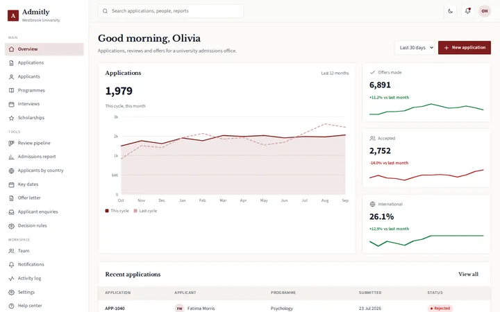](https://mmrahmanbappi.github.io/100-free-admin-dashboards/admitly/) | **50. Admitly** University Admissions  Applications, reviews and offers for a university admissions office.  34 pages / [Live demo](https://mmrahmanbappi.github.io/100-free-admin-dashboards/admitly/) / [Code](admitly/) |
| [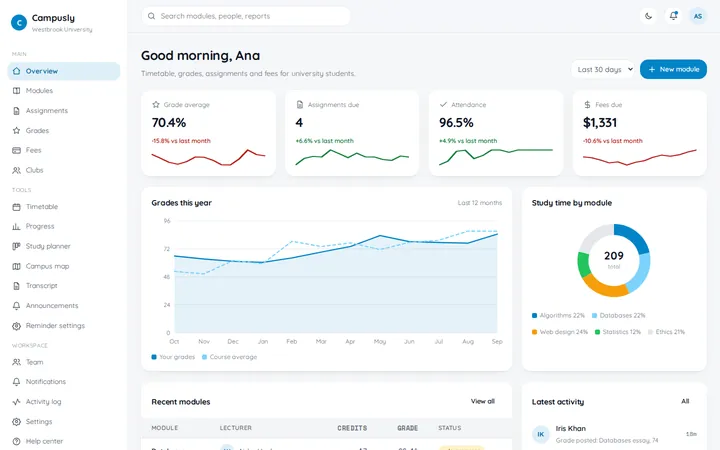](https://mmrahmanbappi.github.io/100-free-admin-dashboards/campusly/) | **51. Campusly** Student Portal  Timetable, grades, assignments and fees for university students.  34 pages / [Live demo](https://mmrahmanbappi.github.io/100-free-admin-dashboards/campusly/) / [Code](campusly/) |
| [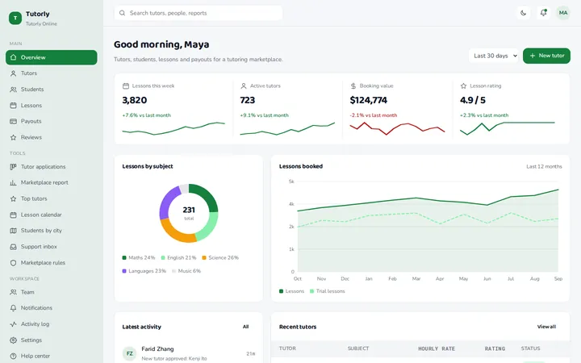](https://mmrahmanbappi.github.io/100-free-admin-dashboards/tutorly/) | **52. Tutorly** Tutor Marketplace  Tutors, students, lessons and payouts for a tutoring marketplace.  34 pages / [Live demo](https://mmrahmanbappi.github.io/100-free-admin-dashboards/tutorly/) / [Code](tutorly/) |
| [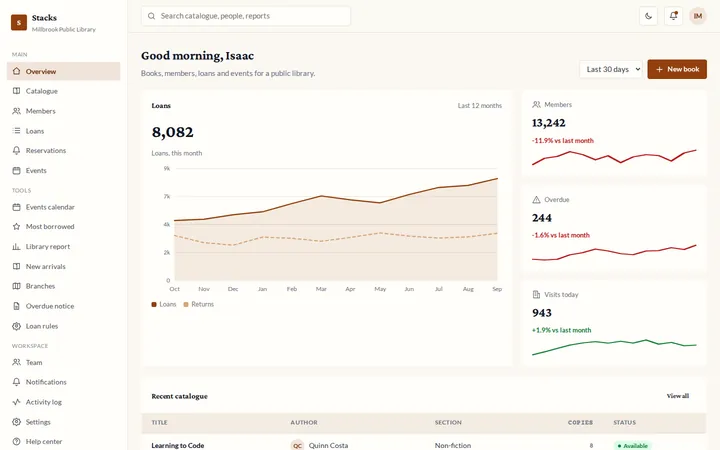](https://mmrahmanbappi.github.io/100-free-admin-dashboards/stacks/) | **53. Stacks** Library  Books, members, loans and events for a public library.  34 pages / [Live demo](https://mmrahmanbappi.github.io/100-free-admin-dashboards/stacks/) / [Code](stacks/) |
| [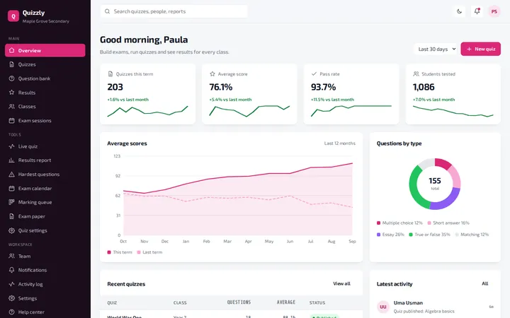](https://mmrahmanbappi.github.io/100-free-admin-dashboards/quizzly/) | **54. Quizzly** Exams and Quizzes  Build exams, run quizzes and see results for every class.  34 pages / [Live demo](https://mmrahmanbappi.github.io/100-free-admin-dashboards/quizzly/) / [Code](quizzly/) |
| [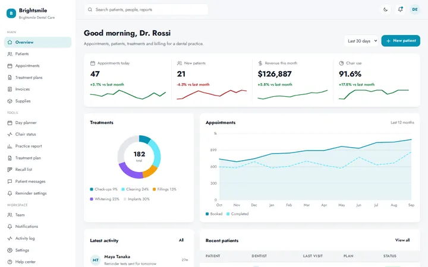](https://mmrahmanbappi.github.io/100-free-admin-dashboards/brightsmile/) | **55. Brightsmile** Dental Clinic  Appointments, patients, treatments and billing for a dental practice.  34 pages / [Live demo](https://mmrahmanbappi.github.io/100-free-admin-dashboards/brightsmile/) / [Code](brightsmile/) |
| [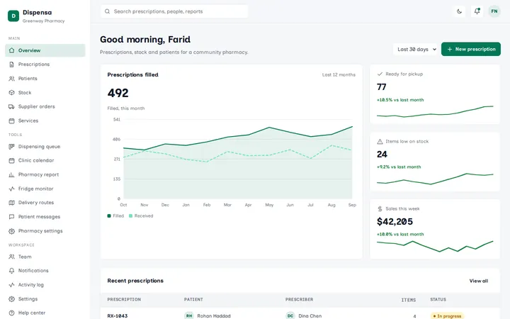](https://mmrahmanbappi.github.io/100-free-admin-dashboards/dispensa/) | **56. Dispensa** Pharmacy  Prescriptions, stock and patients for a community pharmacy.  34 pages / [Live demo](https://mmrahmanbappi.github.io/100-free-admin-dashboards/dispensa/) / [Code](dispensa/) |
| [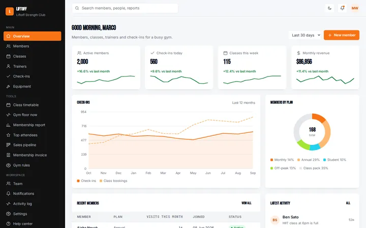](https://mmrahmanbappi.github.io/100-free-admin-dashboards/liftoff/) | **57. Liftoff** Gym and Fitness  Members, classes, trainers and check-ins for a busy gym.  34 pages / [Live demo](https://mmrahmanbappi.github.io/100-free-admin-dashboards/liftoff/) / [Code](liftoff/) |
| [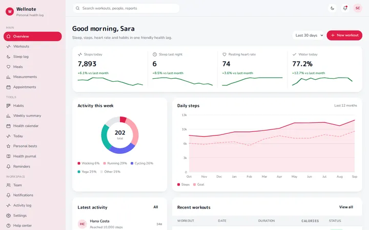](https://mmrahmanbappi.github.io/100-free-admin-dashboards/wellnote/) | **58. Wellnote** Personal Health  Sleep, steps, heart rate and habits in one friendly health log.  34 pages / [Live demo](https://mmrahmanbappi.github.io/100-free-admin-dashboards/wellnote/) / [Code](wellnote/) |
| [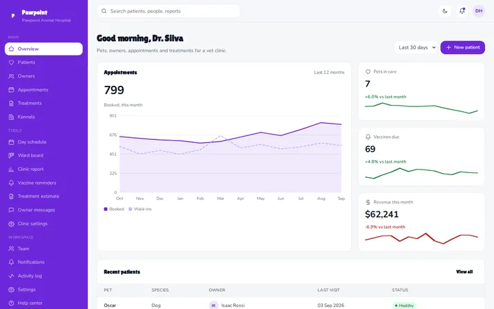](https://mmrahmanbappi.github.io/100-free-admin-dashboards/pawpoint/) | **59. Pawpoint** Veterinary Clinic  Pets, owners, appointments and treatments for a vet clinic.  34 pages / [Live demo](https://mmrahmanbappi.github.io/100-free-admin-dashboards/pawpoint/) / [Code](pawpoint/) |
| [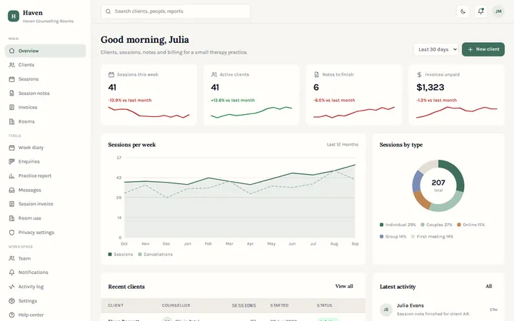](https://mmrahmanbappi.github.io/100-free-admin-dashboards/haven/) | **60. Haven** Therapy Practice  Clients, sessions, notes and billing for a small therapy practice.  34 pages / [Live demo](https://mmrahmanbappi.github.io/100-free-admin-dashboards/haven/) / [Code](haven/) |
| [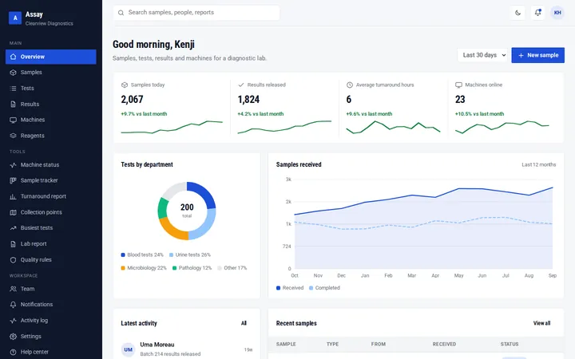](https://mmrahmanbappi.github.io/100-free-admin-dashboards/assay/) | **61. Assay** Diagnostic Lab  Samples, tests, results and machines for a diagnostic lab.  34 pages / [Live demo](https://mmrahmanbappi.github.io/100-free-admin-dashboards/assay/) / [Code](assay/) |
| [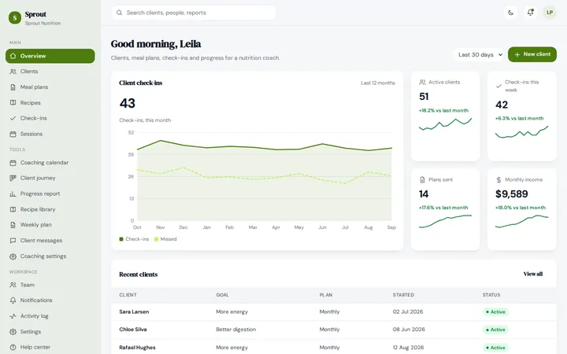](https://mmrahmanbappi.github.io/100-free-admin-dashboards/sprout/) | **62. Sprout** Nutrition Coach  Clients, meal plans, check-ins and progress for a nutrition coach.  34 pages / [Live demo](https://mmrahmanbappi.github.io/100-free-admin-dashboards/sprout/) / [Code](sprout/) |
| [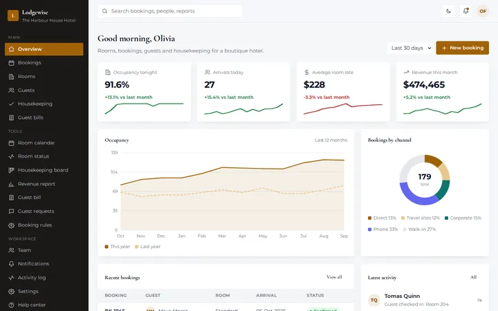](https://mmrahmanbappi.github.io/100-free-admin-dashboards/lodgewise/) | **63. Lodgewise** Hotel  Rooms, bookings, guests and housekeeping for a boutique hotel.  34 pages / [Live demo](https://mmrahmanbappi.github.io/100-free-admin-dashboards/lodgewise/) / [Code](lodgewise/) |
| [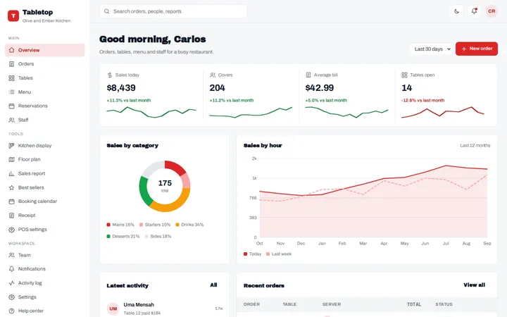](https://mmrahmanbappi.github.io/100-free-admin-dashboards/tabletop/) | **64. Tabletop** Restaurant POS  Orders, tables, menu and staff for a busy restaurant.  34 pages / [Live demo](https://mmrahmanbappi.github.io/100-free-admin-dashboards/tabletop/) / [Code](tabletop/) |
| [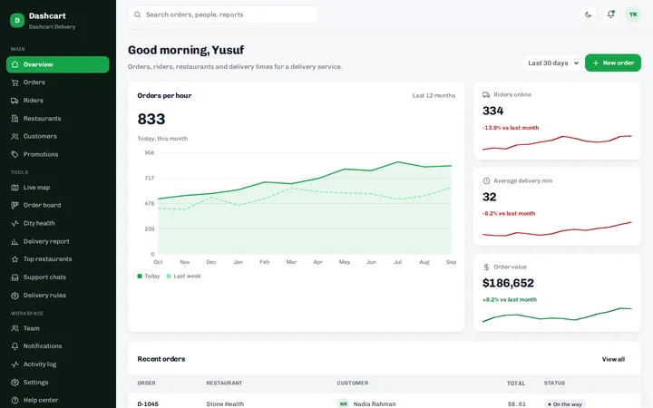](https://mmrahmanbappi.github.io/100-free-admin-dashboards/dashcart/) | **65. Dashcart** Food Delivery  Orders, riders, restaurants and delivery times for a delivery service.  34 pages / [Live demo](https://mmrahmanbappi.github.io/100-free-admin-dashboards/dashcart/) / [Code](dashcart/) |
| [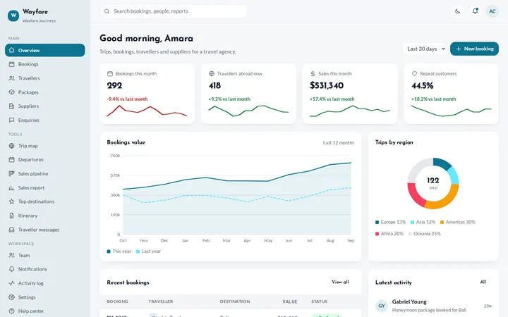](https://mmrahmanbappi.github.io/100-free-admin-dashboards/wayfare/) | **66. Wayfare** Travel Agency  Trips, bookings, travellers and suppliers for a travel agency.  34 pages / [Live demo](https://mmrahmanbappi.github.io/100-free-admin-dashboards/wayfare/) / [Code](wayfare/) |
| [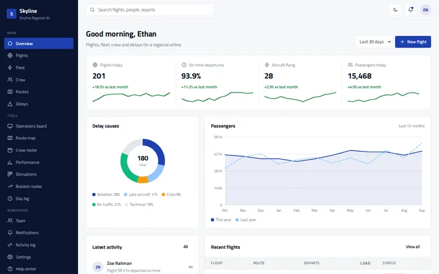](https://mmrahmanbappi.github.io/100-free-admin-dashboards/skyline/) | **67. Skyline** Airline Operations  Flights, fleet, crew and delays for a regional airline.  34 pages / [Live demo](https://mmrahmanbappi.github.io/100-free-admin-dashboards/skyline/) / [Code](skyline/) |
| [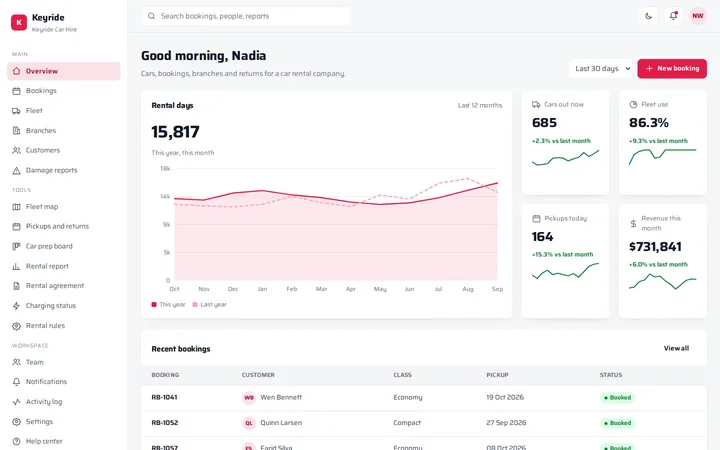](https://mmrahmanbappi.github.io/100-free-admin-dashboards/keyride/) | **68. Keyride** Car Rental  Cars, bookings, branches and returns for a car rental company.  34 pages / [Live demo](https://mmrahmanbappi.github.io/100-free-admin-dashboards/keyride/) / [Code](keyride/) |
| [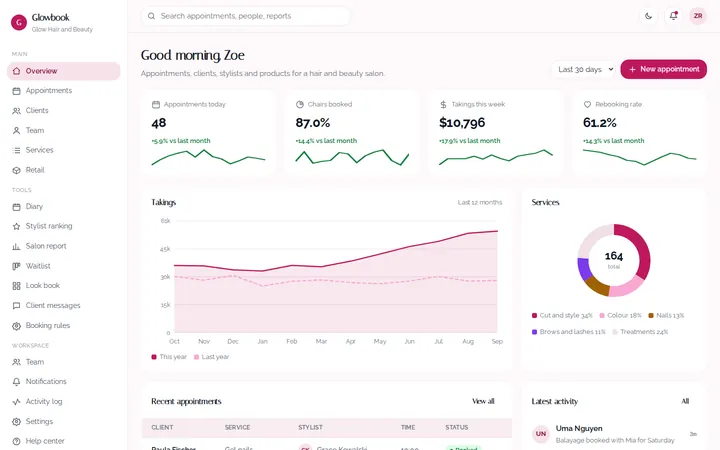](https://mmrahmanbappi.github.io/100-free-admin-dashboards/glowbook/) | **69. Glowbook** Salon Booking  Appointments, clients, stylists and products for a hair and beauty salon.  34 pages / [Live demo](https://mmrahmanbappi.github.io/100-free-admin-dashboards/glowbook/) / [Code](glowbook/) |
| [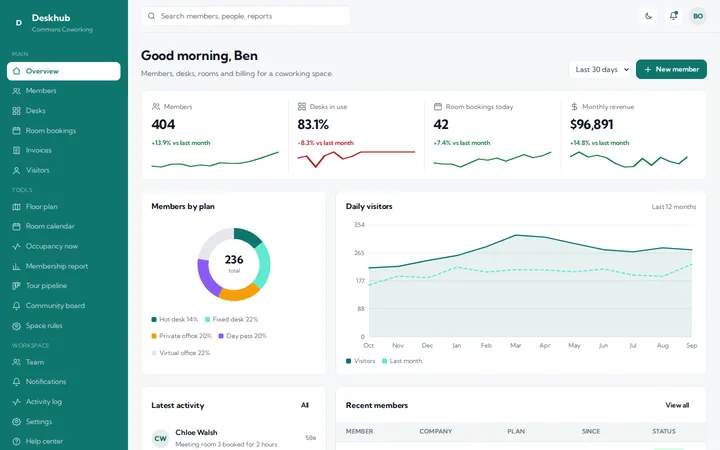](https://mmrahmanbappi.github.io/100-free-admin-dashboards/deskhub/) | **70. Deskhub** Coworking Space  Members, desks, rooms and billing for a coworking space.  34 pages / [Live demo](https://mmrahmanbappi.github.io/100-free-admin-dashboards/deskhub/) / [Code](deskhub/) |
| [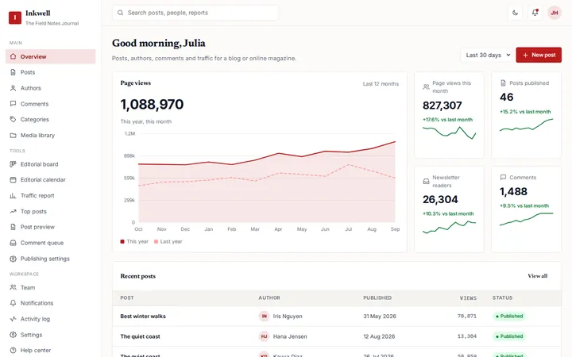](https://mmrahmanbappi.github.io/100-free-admin-dashboards/inkwell/) | **71. Inkwell** Blog CMS  Posts, authors, comments and traffic for a blog or online magazine.  34 pages / [Live demo](https://mmrahmanbappi.github.io/100-free-admin-dashboards/inkwell/) / [Code](inkwell/) |
| [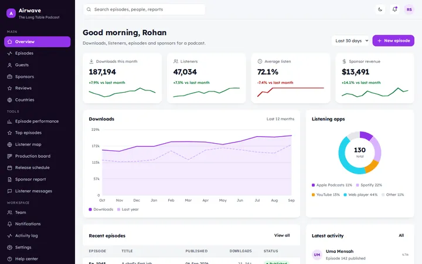](https://mmrahmanbappi.github.io/100-free-admin-dashboards/airwave/) | **72. Airwave** Podcast Analytics  Downloads, listeners, episodes and sponsors for a podcast.  34 pages / [Live demo](https://mmrahmanbappi.github.io/100-free-admin-dashboards/airwave/) / [Code](airwave/) |
| [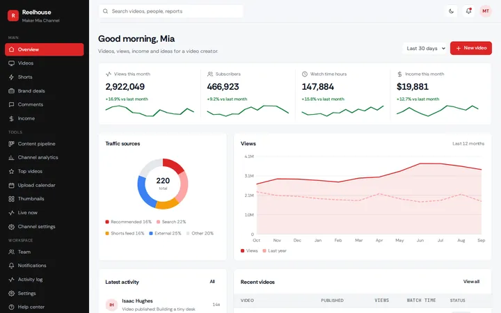](https://mmrahmanbappi.github.io/100-free-admin-dashboards/reelhouse/) | **73. Reelhouse** Video Creator Studio  Videos, views, income and ideas for a video creator.  34 pages / [Live demo](https://mmrahmanbappi.github.io/100-free-admin-dashboards/reelhouse/) / [Code](reelhouse/) |
| [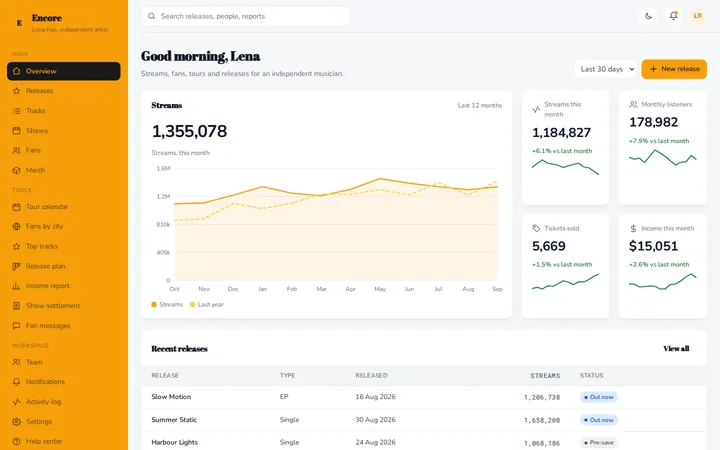](https://mmrahmanbappi.github.io/100-free-admin-dashboards/encore/) | **74. Encore** Music Artist  Streams, fans, tours and releases for an independent musician.  34 pages / [Live demo](https://mmrahmanbappi.github.io/100-free-admin-dashboards/encore/) / [Code](encore/) |
| [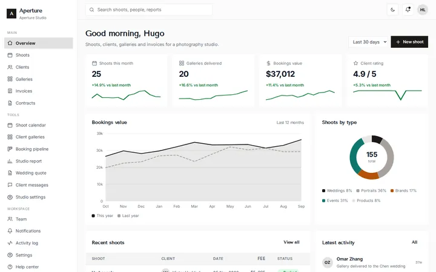](https://mmrahmanbappi.github.io/100-free-admin-dashboards/aperture/) | **75. Aperture** Photography Studio  Shoots, clients, galleries and invoices for a photography studio.  34 pages / [Live demo](https://mmrahmanbappi.github.io/100-free-admin-dashboards/aperture/) / [Code](aperture/) |
| [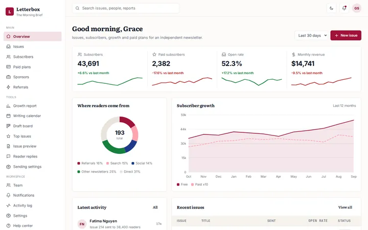](https://mmrahmanbappi.github.io/100-free-admin-dashboards/letterbox/) | **76. Letterbox** Newsletter  Issues, subscribers, growth and paid plans for an independent newsletter.  34 pages / [Live demo](https://mmrahmanbappi.github.io/100-free-admin-dashboards/letterbox/) / [Code](letterbox/) |
| [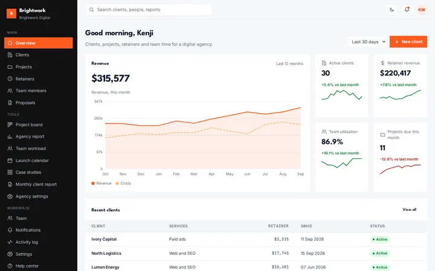](https://mmrahmanbappi.github.io/100-free-admin-dashboards/brightwork/) | **77. Brightwork** Digital Agency  Clients, projects, retainers and team time for a digital agency.  34 pages / [Live demo](https://mmrahmanbappi.github.io/100-free-admin-dashboards/brightwork/) / [Code](brightwork/) |
| [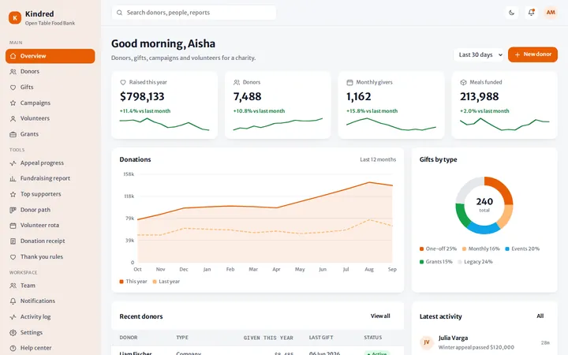](https://mmrahmanbappi.github.io/100-free-admin-dashboards/kindred/) | **78. Kindred** Nonprofit Donations  Donors, gifts, campaigns and volunteers for a charity.  34 pages / [Live demo](https://mmrahmanbappi.github.io/100-free-admin-dashboards/kindred/) / [Code](kindred/) |
| [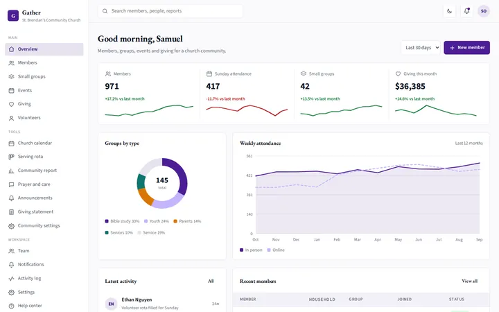](https://mmrahmanbappi.github.io/100-free-admin-dashboards/gather/) | **79. Gather** Church and Community  Members, groups, events and giving for a church community.  34 pages / [Live demo](https://mmrahmanbappi.github.io/100-free-admin-dashboards/gather/) / [Code](gather/) |
| [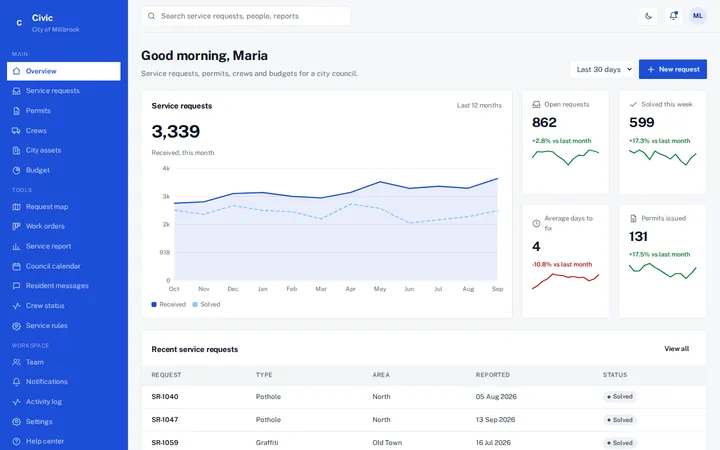](https://mmrahmanbappi.github.io/100-free-admin-dashboards/civic/) | **80. Civic** City Services  Service requests, permits, crews and budgets for a city council.  34 pages / [Live demo](https://mmrahmanbappi.github.io/100-free-admin-dashboards/civic/) / [Code](civic/) |
| [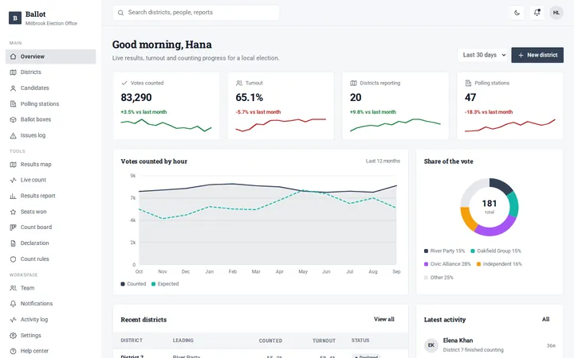](https://mmrahmanbappi.github.io/100-free-admin-dashboards/ballot/) | **81. Ballot** Election Results  Live results, turnout and counting progress for a local election.  34 pages / [Live demo](https://mmrahmanbappi.github.io/100-free-admin-dashboards/ballot/) / [Code](ballot/) |
| [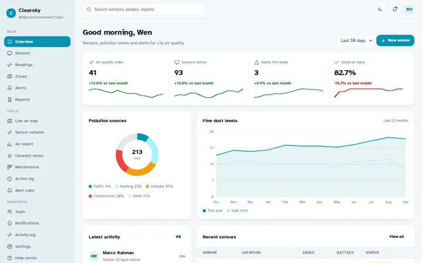](https://mmrahmanbappi.github.io/100-free-admin-dashboards/clearsky/) | **82. Clearsky** Air Quality  Sensors, pollution levels and alerts for city air quality.  34 pages / [Live demo](https://mmrahmanbappi.github.io/100-free-admin-dashboards/clearsky/) / [Code](clearsky/) |
| [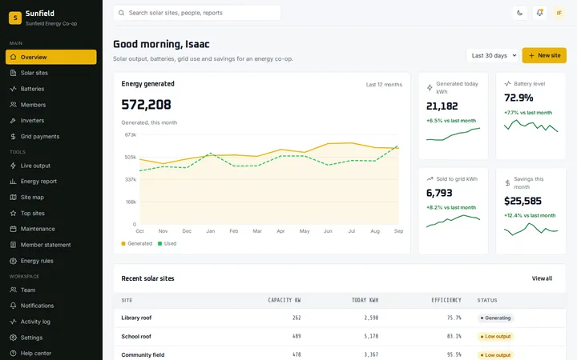](https://mmrahmanbappi.github.io/100-free-admin-dashboards/sunfield/) | **83. Sunfield** Solar and Energy  Solar output, batteries, grid use and savings for an energy co-op.  34 pages / [Live demo](https://mmrahmanbappi.github.io/100-free-admin-dashboards/sunfield/) / [Code](sunfield/) |
| [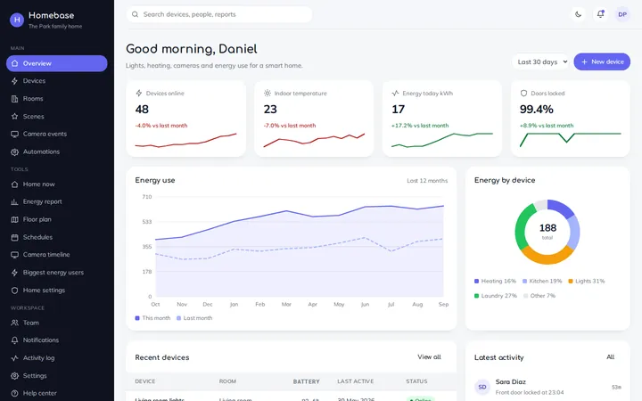](https://mmrahmanbappi.github.io/100-free-admin-dashboards/homebase/) | **84. Homebase** Smart Home  Lights, heating, cameras and energy use for a smart home.  34 pages / [Live demo](https://mmrahmanbappi.github.io/100-free-admin-dashboards/homebase/) / [Code](homebase/) |
| [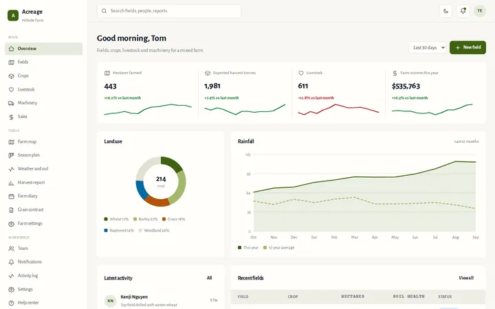](https://mmrahmanbappi.github.io/100-free-admin-dashboards/acreage/) | **85. Acreage** Farm and Agriculture  Fields, crops, livestock and machinery for a mixed farm.  34 pages / [Live demo](https://mmrahmanbappi.github.io/100-free-admin-dashboards/acreage/) / [Code](acreage/) |
| [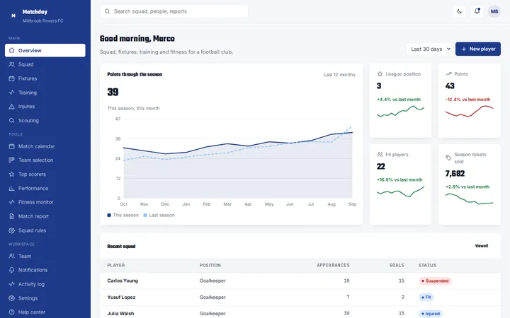](https://mmrahmanbappi.github.io/100-free-admin-dashboards/matchday/) | **86. Matchday** Sports Team  Squad, fixtures, training and fitness for a football club.  34 pages / [Live demo](https://mmrahmanbappi.github.io/100-free-admin-dashboards/matchday/) / [Code](matchday/) |
| [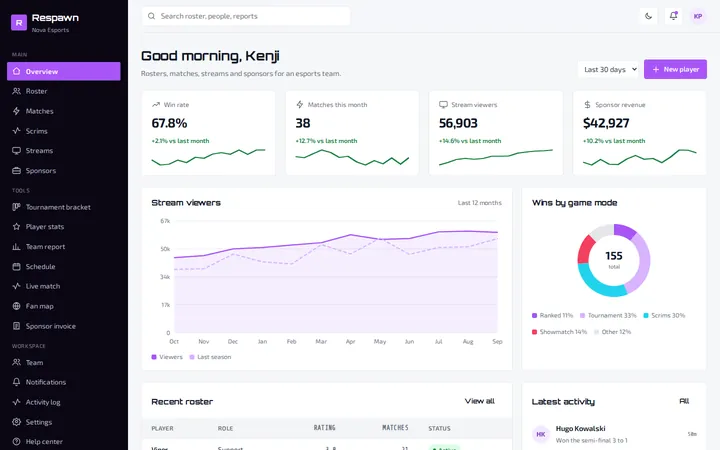](https://mmrahmanbappi.github.io/100-free-admin-dashboards/respawn/) | **87. Respawn** Esports  Rosters, matches, streams and sponsors for an esports team.  34 pages / [Live demo](https://mmrahmanbappi.github.io/100-free-admin-dashboards/respawn/) / [Code](respawn/) |
| [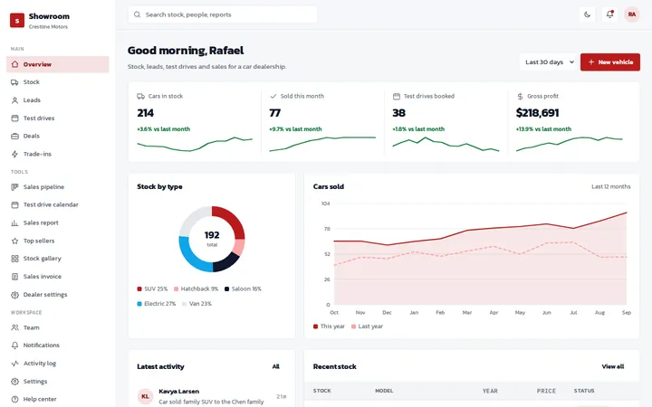](https://mmrahmanbappi.github.io/100-free-admin-dashboards/showroom/) | **88. Showroom** Car Dealership  Stock, leads, test drives and sales for a car dealership.  34 pages / [Live demo](https://mmrahmanbappi.github.io/100-free-admin-dashboards/showroom/) / [Code](showroom/) |
| [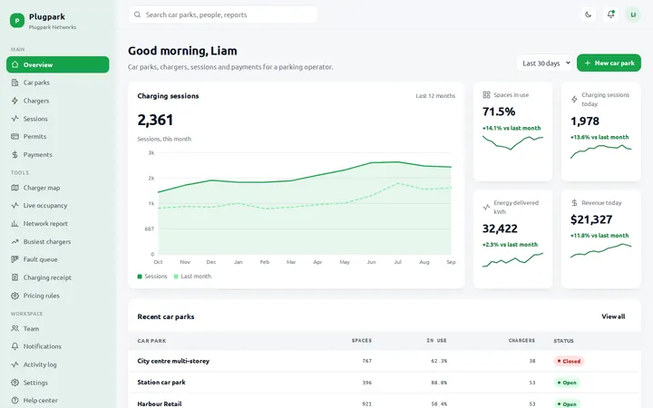](https://mmrahmanbappi.github.io/100-free-admin-dashboards/plugpark/) | **89. Plugpark** Parking and EV Charging  Car parks, chargers, sessions and payments for a parking operator.  34 pages / [Live demo](https://mmrahmanbappi.github.io/100-free-admin-dashboards/plugpark/) / [Code](plugpark/) |
| [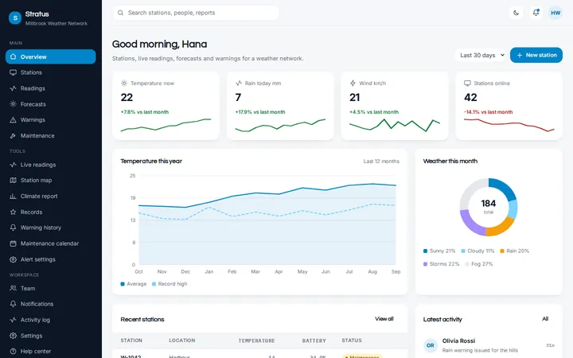](https://mmrahmanbappi.github.io/100-free-admin-dashboards/stratus/) | **90. Stratus** Weather Station  Stations, live readings, forecasts and warnings for a weather network.  34 pages / [Live demo](https://mmrahmanbappi.github.io/100-free-admin-dashboards/stratus/) / [Code](stratus/) |
| [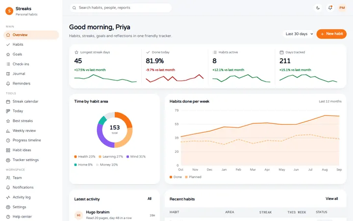](https://mmrahmanbappi.github.io/100-free-admin-dashboards/streaks/) | **91. Streaks** Habit Tracker  Habits, streaks, goals and reflections in one friendly tracker.  34 pages / [Live demo](https://mmrahmanbappi.github.io/100-free-admin-dashboards/streaks/) / [Code](streaks/) |
| [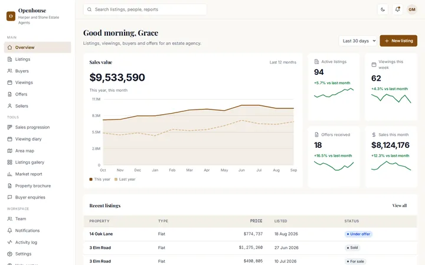](https://mmrahmanbappi.github.io/100-free-admin-dashboards/openhouse/) | **92. Openhouse** Real Estate Agency  Listings, viewings, buyers and offers for an estate agency.  34 pages / [Live demo](https://mmrahmanbappi.github.io/100-free-admin-dashboards/openhouse/) / [Code](openhouse/) |
| [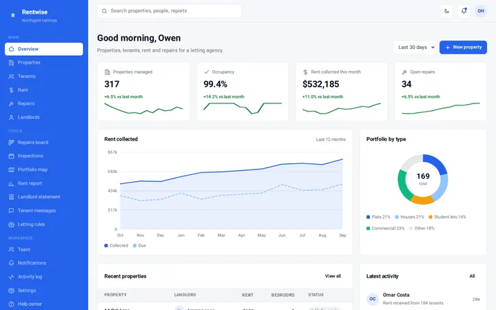](https://mmrahmanbappi.github.io/100-free-admin-dashboards/rentwise/) | **93. Rentwise** Property Management  Properties, tenants, rent and repairs for a letting agency.  34 pages / [Live demo](https://mmrahmanbappi.github.io/100-free-admin-dashboards/rentwise/) / [Code](rentwise/) |
| [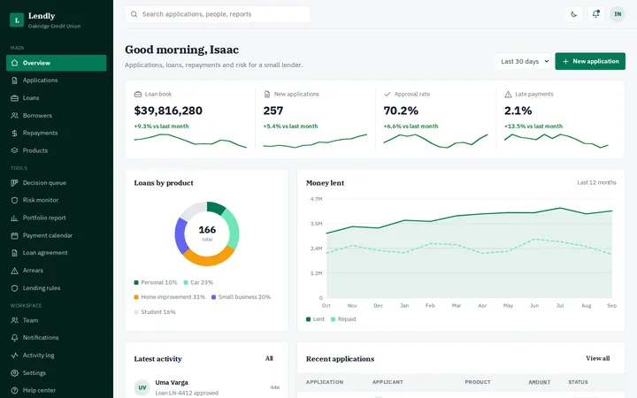](https://mmrahmanbappi.github.io/100-free-admin-dashboards/lendly/) | **94. Lendly** Loan Lending  Applications, loans, repayments and risk for a small lender.  34 pages / [Live demo](https://mmrahmanbappi.github.io/100-free-admin-dashboards/lendly/) / [Code](lendly/) |
| [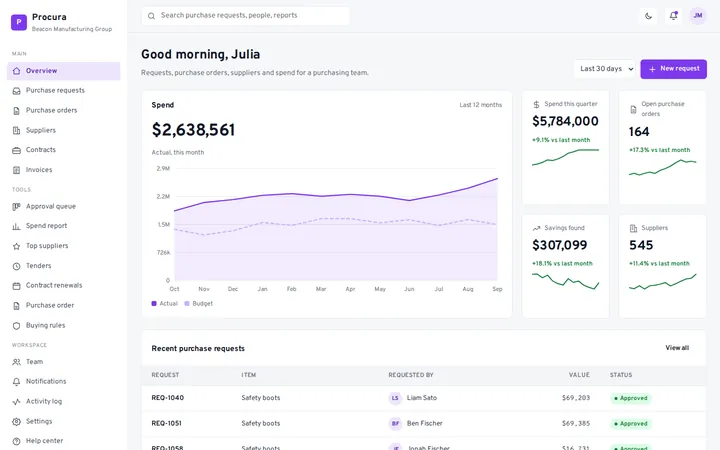](https://mmrahmanbappi.github.io/100-free-admin-dashboards/procura/) | **95. Procura** Procurement  Requests, purchase orders, suppliers and spend for a purchasing team.  34 pages / [Live demo](https://mmrahmanbappi.github.io/100-free-admin-dashboards/procura/) / [Code](procura/) |

## Coming next

Surveys and NPS, Events and ticketing, Facility management, Field service.

## License

[MIT](LICENSE). Some dashboards include third-party fonts and libraries with their own open licenses, listed in their folders.

Made by [MM Rahman Bappi](https://mmseo.app/).
